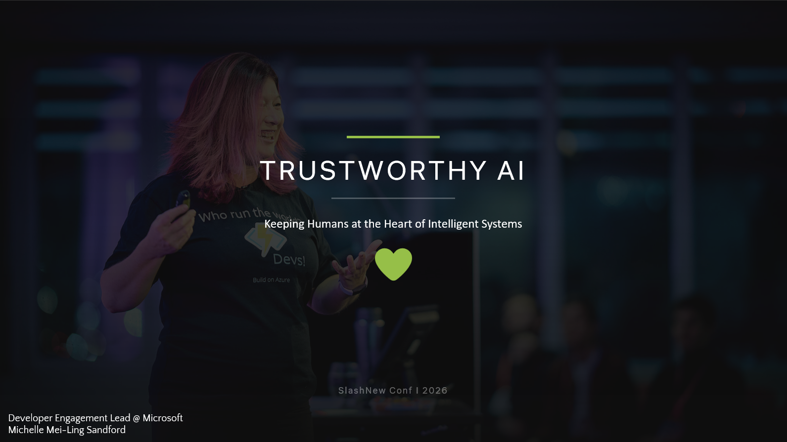

<a class="sn-back" href="../../">← Back</a>

Opening

# Welcome to SlashNew

*Why we're here, who this talk is for, and the one question we keep coming back to.*
## Hello, SlashNew

Thanks for being here. I'm **@Codess-Aus**, and for the next 45 minutes I want to talk to you about something that has been keeping me, and a lot of the engineers I work with, awake at night.

We are shipping AI faster than we are learning to govern it.

That isn't a doom statement. I'm wildly optimistic about where this is going. But optimism without rigor is just marketing. So this talk is the rigor I wish someone had handed me eighteen months ago.

## Who this is for

- Engineers and platform teams adopting Copilot, agents, or LLM-backed features.
- Tech leads who have to answer "is it safe to ship?" on a Friday afternoon.
- Anyone whose name is on the change that goes live on Monday.

## The one question

> *Would I trust this system to make this decision about me, my family, or my customer?*

That's it. That's the whole talk. The next 21 chapters are just different ways of getting to a confident **yes**.
