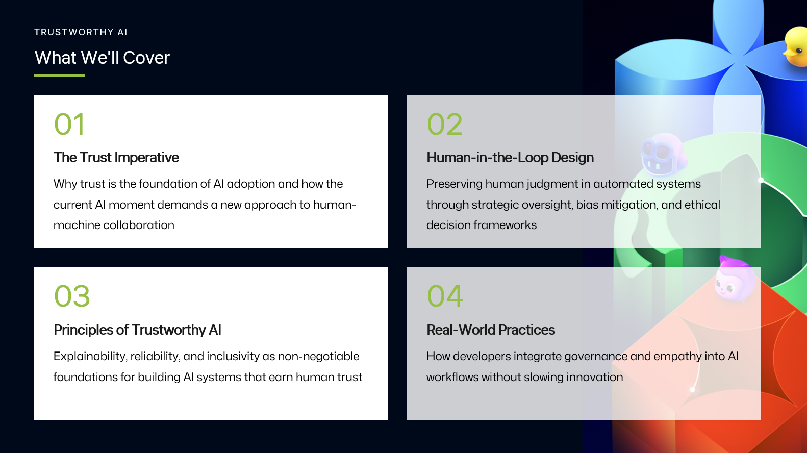

<a class="sn-back" href="../../">← Back to Blog</a>

February 16, 2026

# The Agenda

*A roadmap through trust, oversight, governance and the three waves of AI that brought us here.*
## What we'll cover

1. **Rule Zero** — the non-negotiable that sits above every other decision.
2. **The Right Way** — what Microsoft's Responsible AI Standard actually asks of us.
3. **Trust as UX** — designing for confidence, not just correctness.
4. **Human in the loop** — patterns that work, and theatre that doesn't.
5. **Principles, explainability, reliability, inclusivity** — the engineering translation.
6. **Real-world stories** — three case studies, including one that broke.
7. **The three waves** — autocomplete, chat, agents.
8. **Governance and empathy** — leading teams through the change.
9. **Take action** — five things to do on Monday.

## How to read this

Each chapter is short on purpose. You should be able to skim the whole thing in a coffee break, or sink into one chapter for a team discussion. There are no slides hidden from you — this site *is* the talk.
