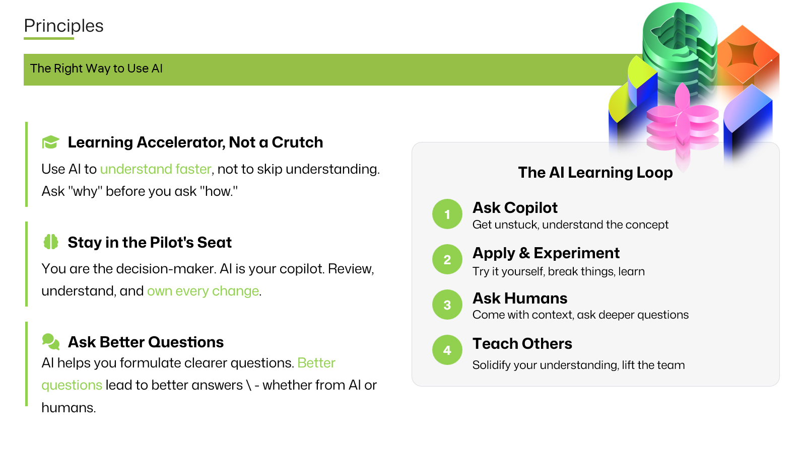

<a class="sn-back" href="../../">← Back</a>

Foundation

# The Right Way

*Microsoft's Responsible AI Standard, in plain English. What it actually asks of you on a Tuesday.*
## The Standard, decoded

Microsoft's Responsible AI Standard is a beautifully comprehensive document. It is also 80+ pages long, and most of your team will never read it. That's fine. Here's the working version.

The Standard asks you, for every AI feature, to be able to answer:

| Question | Where it lives in your team |
|---|---|
| What is this system *for*? | Product spec, one paragraph, plain English. |
| Who could it harm, and how? | Impact Assessment (lightweight is fine to start). |
| How do we know it works? | Eval suite, with regression guardrails. |
| How will users know what it is? | UX copy, disclosures, model cards. |
| What happens when it's wrong? | Fallback path, human handoff, appeal. |
| Who is accountable? | A name. Not a team. A name. |

## A Tuesday-sized practice

You don't need a Responsible AI center of excellence to start. You need:

- A **one-page impact note** at the top of every feature doc.
- An **eval harness** that runs on every PR that touches the prompt, the model, or the tools.
- A **named owner** in the README.

Those three artefacts will get you 80% of the value of the Standard, today.

## Further reading

- [Microsoft Responsible AI Standard v2](https://www.microsoft.com/ai/responsible-ai)
- [Microsoft Learn, Responsible AI principles](https://learn.microsoft.com/training/modules/responsible-ai-principles/)
