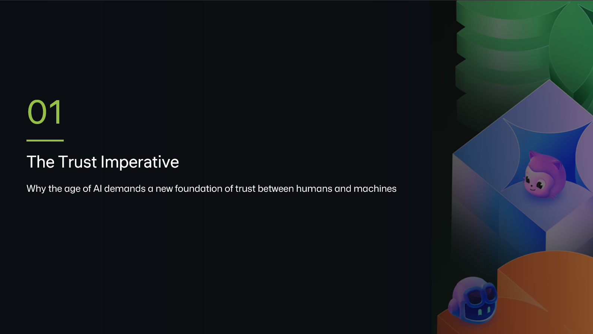

<a class="sn-back" href="../../">← Back</a>

Foundation

# Earning Trust

*Trust isn't a feature you toggle on. It's a UX, a process and a contract.*
## Trust is a UX problem

Engineers love to treat trust as a *correctness* problem. "If the model is right enough, people will trust it."

That isn't how humans work. People trust systems that are:

- **Predictable**, same input, same shape of answer.
- **Legible**, I can see what it did and why.
- **Recoverable**, when it's wrong, I can fix it without drama.
- **Bounded**, I know what it *won't* do.

A highly accurate model that nobody trusts is less useful than a slightly less accurate one that an entire team relies on. The difference is almost always one of those four things.

## The trust contract

Treat every AI feature as a contract with the user:

> *"I will tell you what I'm about to do, do it inside these bounds, show you what I did, and let you undo it."*

If your feature can't honour that sentence, the answer isn't "ship anyway and add a disclaimer." The answer is "go back to design."

## A concrete pattern

For agentic actions in GitHub Copilot, the trust contract often looks like:

1. **Plan**, show the steps before running.
2. **Confirm**, let the human approve, edit or reject.
3. **Execute**, stream the work, file by file.
4. **Diff**, show what changed, in a reviewable form.
5. **Revert**, one button, no questions.

That loop is why people trust agent mode. Take any of those steps out and trust collapses.
