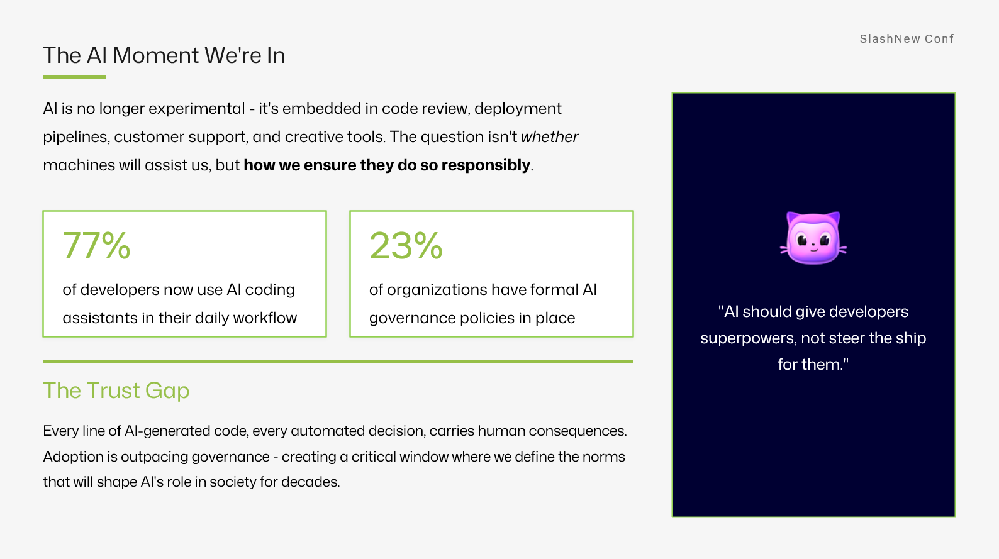

<a class="sn-back" href="../../">← Back</a>

Context

# The Moment

*We're inside the inflection. Why "general-purpose reasoning in the IDE" changes the shape of every team.*
## This is the moment

I want to be careful with hype. But something genuinely new is happening in software.

For a long time, the bottleneck on a team has been **typing-speed-of-thought**, how fast we can translate an idea into working code. We're now living through the first technology that meaningfully moves that bottleneck.

That doesn't mean engineers are obsolete. It means the *shape* of engineering is changing.

## What's actually different

- **The unit of work is shrinking.** Issues become PRs in minutes, not days.
- **The skill mix is shifting.** Reading code, reviewing changes, and writing crisp specs are now leverage.
- **Time-to-first-feedback is collapsing.** You can prototype five approaches in the time it used to take to scaffold one.

## What hasn't changed

- Production is still production.
- Security still matters.
- Your customers still notice when things break.
- The senior engineer in the room is still the one who knows *which* of the five prototypes is the right one to ship.

The moment is real. The fundamentals are the same.
