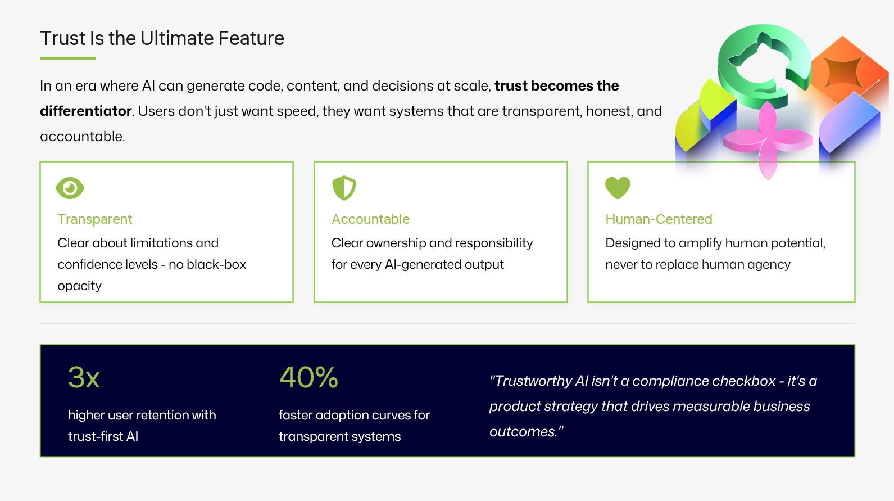

<a class="sn-back" href="../../">← Back</a>

Mindset

# It's a Feature, Not a Bug

*Hallucinations, uncertainty, refusal, sometimes they're the product working.*
## Reframing the "bug" list

When people complain about LLMs, the complaints usually land in three buckets:

1. **It made things up.**
2. **It refused to do the thing I asked.**
3. **It said it wasn't sure.**

Here's the uncomfortable take: all three are often the product working as intended.

## Hallucination as a calibration problem

A model that generates fluent, plausible text *will* generate fluent, plausible text even when it doesn't know. That's not a bug, that's how generative systems behave. The bug is shipping that text without **grounding** (retrieval, tools, citations) and without a UX that signals uncertainty.

Fix the system, not the model.

## Refusal as a safety feature

A model that refuses to help you write a phishing email is doing exactly what we want. Yes, refusals are sometimes over-broad. Yes, that's annoying. But "annoyingly cautious" is a better default than "cheerfully harmful."

## "I'm not sure" as a gift

If your model can tell you it's uncertain, **expose that in the UI**. A confidence band, a "verify this" badge, a citation link, these are how you turn a probabilistic system into a trustworthy one.

The features we used to call bugs are the surface area you build trust on top of.
