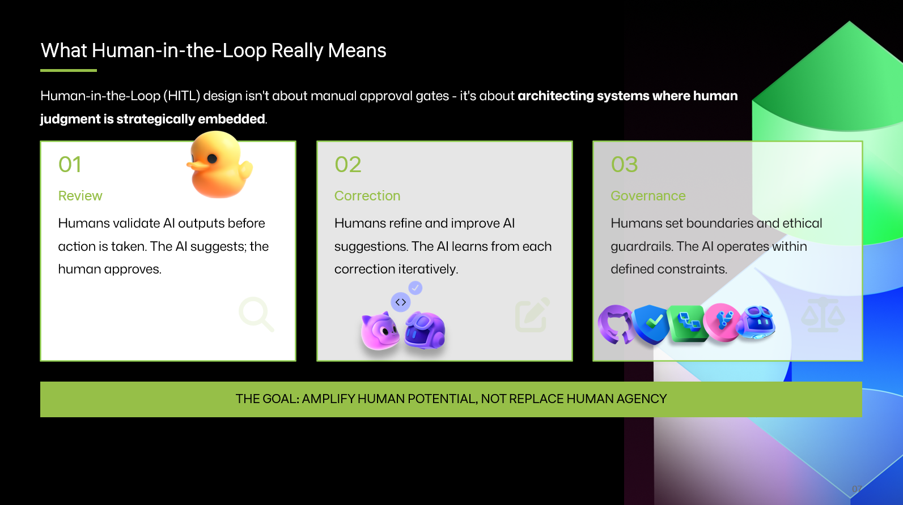

<a class="sn-back" href="../../">← Back</a>

Mindset

# Amplify, Don't Replace

*The teams winning with Copilot aren't replacing engineers. They're amplifying judgment.*
## The replacement framing is wrong

A lot of commentary frames AI as replacing engineers. That framing is mostly wrong, and it's mostly wrong in the same way: it confuses **tasks** with **jobs**.

Yes, a lot of tasks I used to do by hand, boilerplate, scaffolding, first-draft docs, glue code, are now one prompt away. That's good. None of that was the job.

The job was, and is:

- Understanding the problem.
- Designing a system that fits the constraints.
- Making trade-offs you can defend.
- Owning the outcome when it ships.

## Amplification in practice

Teams that thrive with Copilot tend to share a few habits:

- They **review every diff** the agent produces, the same way they'd review a junior engineer's PR.
- They invest in **specs and tests** more than they used to, because those are the artefacts that steer the agent.
- They treat the model as a **fast collaborator**, not an oracle.
- They keep a **"what we don't let it touch"** list, and review it every quarter.

## A useful question

Before you let an agent do something on your behalf, ask: *"If this were a new hire on day one, would I let them do this unsupervised?"*

The answer is your governance model.
