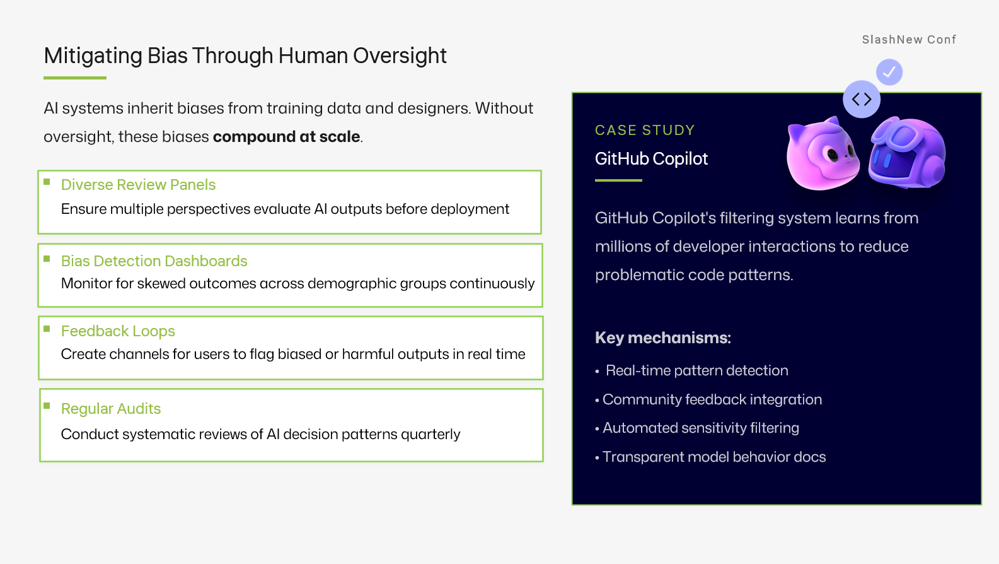

<a class="sn-back" href="../../">← Back to Blog</a>

February 16, 2026

# Meaningful Oversight

*Approval buttons aren't oversight. What real, decision-grade human review looks like.*
## Oversight ≠ approval UI

I want to drive this point home with a hammer. **Approval is a UI pattern. Oversight is a system property.**

You can have approval everywhere and oversight nowhere. The signs:

- The same person approves everything.
- Approvals happen in seconds, on a phone, between meetings.
- There's no audit trail of *why* something was approved.
- "Reject" is a worse user experience than "approve."

## What meaningful oversight looks like

- **Diversity.** More than one person can review. Reviewers rotate.
- **Context.** Reviewers see the inputs, the plan, the model's reasoning and the proposed action — together.
- **Time.** There's a reasonable SLA, not "instant or it blocks production."
- **Symmetry.** Rejecting is as easy as approving, and rejection produces a useful artefact (a comment, a label, a follow-up issue).
- **Audit.** Every decision is queryable months later.

## The GitHub-shaped version

GitHub gives you most of this for free: pull requests, required reviewers, branch protections, audit logs, CODEOWNERS. If your AI system is producing changes that live outside that system, you have rebuilt — badly — what you already had.

> Whenever possible, **make the agent's output a PR**, and let your existing review culture do the work.
