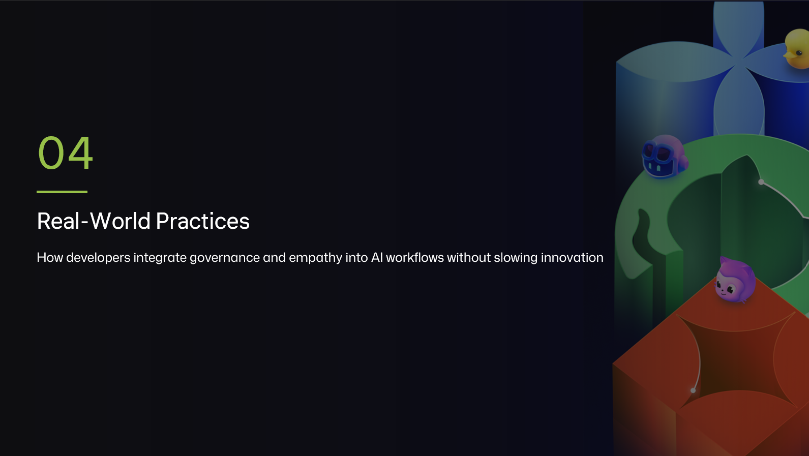

<a class="sn-back" href="../../">← Back to Blog</a>

February 16, 2026

# Real-World Stories

*Three short case studies — what worked, what broke, and what we learned.*
## Story 1 — The triage agent that worked

A platform team built a Copilot-driven triage agent for their issue tracker. It read new issues, suggested labels, owners and priority, and posted as a draft comment. A human always pressed the button.

**Why it worked:** the agent never *acted* — it always *suggested*. Approval was the default human workflow anyway. Median triage time dropped 60% in eight weeks. Nobody felt replaced. Several engineers said it was the first internal AI tool they actually liked.

## Story 2 — The PR bot that broke

Another team wired an agent to auto-close stale PRs and post a templated comment. It went well for three weeks. Then a long-running fork-of-a-fork PR — the only path to a critical hotfix — got auto-closed at 2 a.m. on a Sunday.

**Why it broke:** no blast-radius thinking. The agent had no awareness of *which* PRs were safe to close. The fix wasn't to make the agent smarter. The fix was to **scope it** — only close PRs older than 90 days *and* with no commits from CODEOWNERS *and* with no linked incident.

## Story 3 — The eval suite that saved us

A team shipped a customer-facing summarization feature. Two months in, a routine model update silently changed tone — summaries became more confident and less hedged. Nobody noticed until a customer complained.

The eval suite caught it on the next run, with a regression on the "hedging" axis. The team rolled back the model in 40 minutes. Without the eval suite, this would have been a much worse story.

> Lesson across all three: **the system is the unit of reliability, not the model**. Ship the system.
