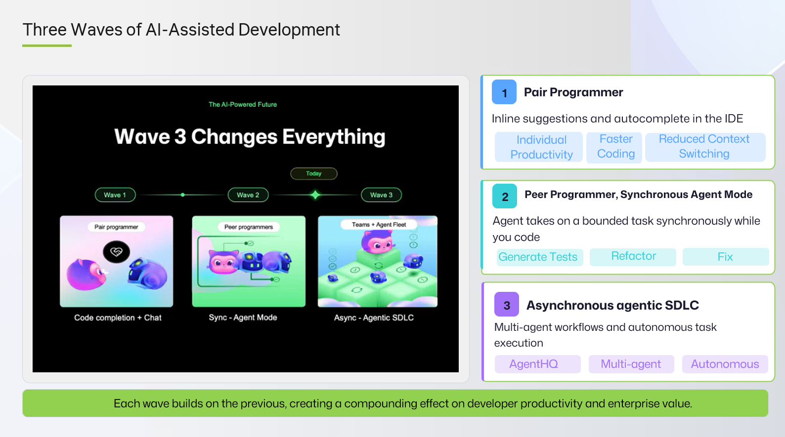

<a class="sn-back" href="../../">← Back</a>

Context

# The Three Waves

*From autocomplete, to chat, to agents. Where you sit on the wave changes what "good" looks like.*
## Three waves, three mindsets

We've lived through three distinct waves of developer AI in a very short time.

### Wave 1, Autocomplete

Inline suggestions. Low stakes. The human is in the driver's seat for every keystroke. "Good" means *useful suggestions that don't slow me down*.

### Wave 2, Chat

Conversational assistants in the IDE and the browser. The human asks, the model answers. "Good" means *accurate, grounded, well-cited answers I can act on*.

### Wave 3, Agents

The model takes multi-step actions on your behalf, using tools, across files, sometimes across systems. The human reviews **outcomes**, not keystrokes. "Good" now means *predictable plans, reviewable diffs, and reversibility*.

## Why this matters

The governance model that worked for Wave 1, basically, "let people use it", does not work for Wave 3. Agents change:

- The **blast radius** (multi-file, multi-system).
- The **review surface** (plans and diffs, not lines).
- The **failure modes** (silent drift, tool misuse, scope creep).
- The **trust contract** (you're now approving *intent*, not *output*).

If your team is in Wave 3 with Wave 1 governance, you will have a bad week. Build the governance for the wave you're actually on.
