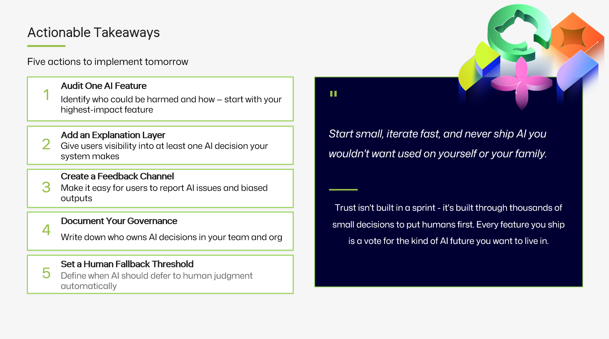

<a class="sn-back" href="../../">← Back</a>

Closing

# Take Action

*Five concrete things to do on Monday. No theory. Just the next move.*
## Monday morning, five things

If you only do five things from this talk, do these.

### 1. Inventory

List every AI feature in your product. Owner, tier, link to evals. Put it in a wiki. Update it monthly. You cannot govern what you cannot see.

### 2. Write Rule Zero on the wall

Literally. A sticker, a Slack pin, a banner in your repo template. Make it impossible to ship without bumping into it.

### 3. Stand up an eval harness

Pick **one** AI feature. Write 20 prompts with expected behaviour. Run them in CI. Block merges on regression. You'll thank yourself within a month.

### 4. Make the agent's output a PR

If you have any agentic system writing changes, route it through a pull request with required reviewers. Reuse the review culture you already have.

### 5. Schedule a "what surprised us" session

Half an hour. Once a month. With the team. See [Chapter 18 — Leading with Empathy](18-empathy.md).

## That's it

You don't need to boil the ocean. You need to ship the next thing **responsibly**, then the one after that. Compound interest does the rest.
