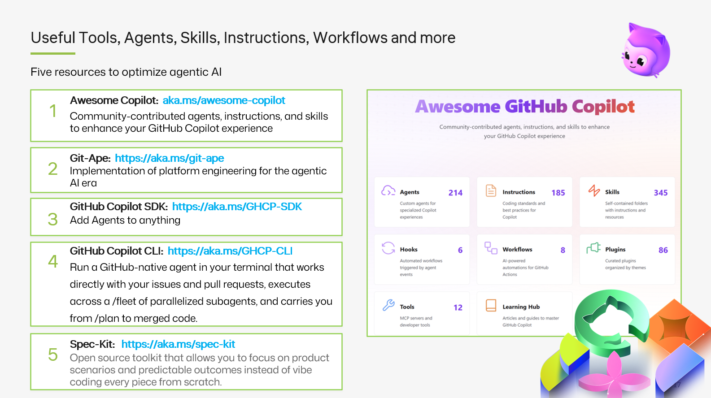

<a class="sn-back" href="../../">← Back</a>

Closing

# Resources

*Microsoft Learn paths, GitHub docs, books and tools, the curated reading list behind the talk.*
## Microsoft Learn

- [Responsible AI principles and approach](https://learn.microsoft.com/training/modules/responsible-ai-principles/)
- [Evaluate generative AI models](https://learn.microsoft.com/azure/ai-studio/concepts/evaluation-approach-gen-ai)
- [Plan and prepare to develop AI solutions responsibly](https://learn.microsoft.com/training/paths/responsible-ai-business-principles/)
- [Microsoft Cloud Adoption Framework, AI](https://learn.microsoft.com/azure/cloud-adoption-framework/scenarios/ai/)

## GitHub

- [GitHub Copilot trust center](https://copilot.github.trust.page/)
- [GitHub Copilot documentation](https://docs.github.com/copilot)
- [Building responsibly with GitHub Copilot (GitHub Blog)](https://github.blog/)
- [GitHub Advanced Security](https://docs.github.com/code-security)

## Standards & frameworks

- [Microsoft Responsible AI Standard v2](https://www.microsoft.com/ai/responsible-ai)
- [NIST AI Risk Management Framework](https://www.nist.gov/itl/ai-risk-management-framework)
- [OWASP Top 10 for LLM Applications](https://owasp.org/www-project-top-10-for-large-language-model-applications/)
- [EU AI Act, high-level summary](https://digital-strategy.ec.europa.eu/en/policies/regulatory-framework-ai)

## Books I keep coming back to

- *Weapons of Math Destruction*, Cathy O'Neil
- *The Alignment Problem*, Brian Christian
- *Atlas of AI*, Kate Crawford
- *Designing Machine Learning Systems*, Chip Huyen

## The meta-resource

> Whatever you read, **read with your own product in your head**. Theory only becomes practice when you can name the line of code it would change.
