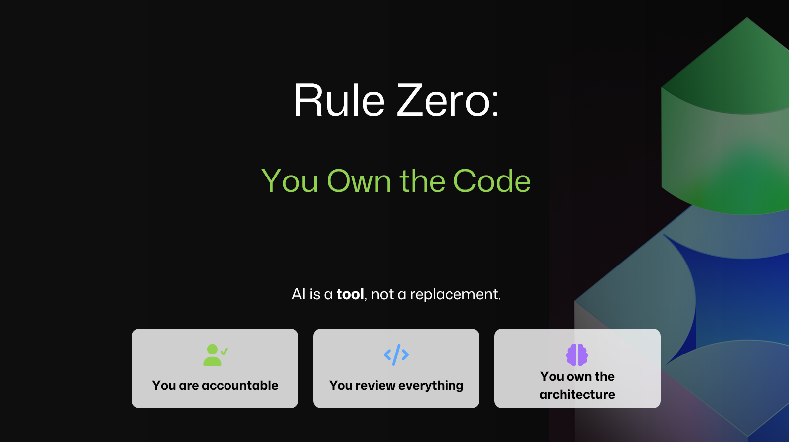
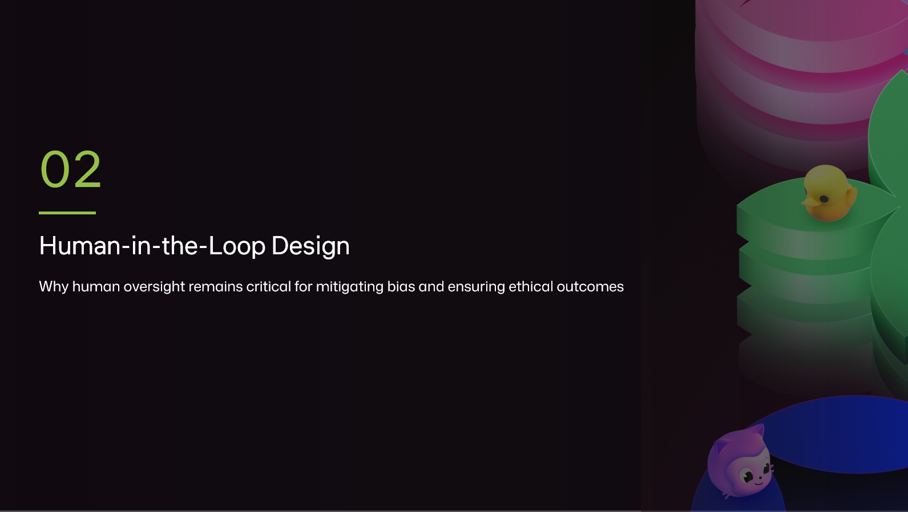
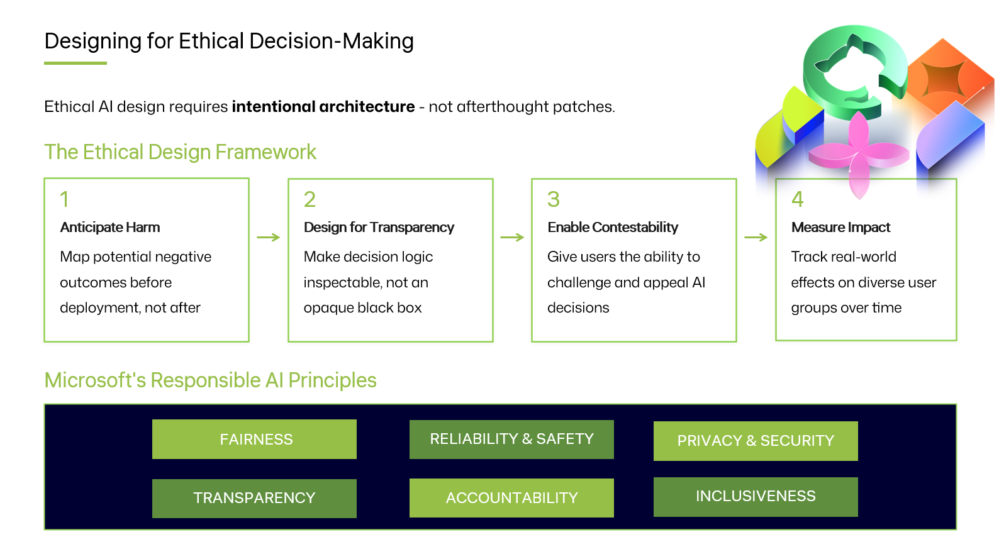
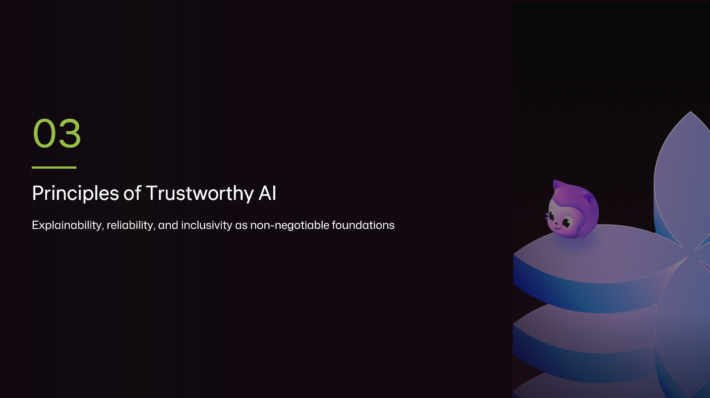
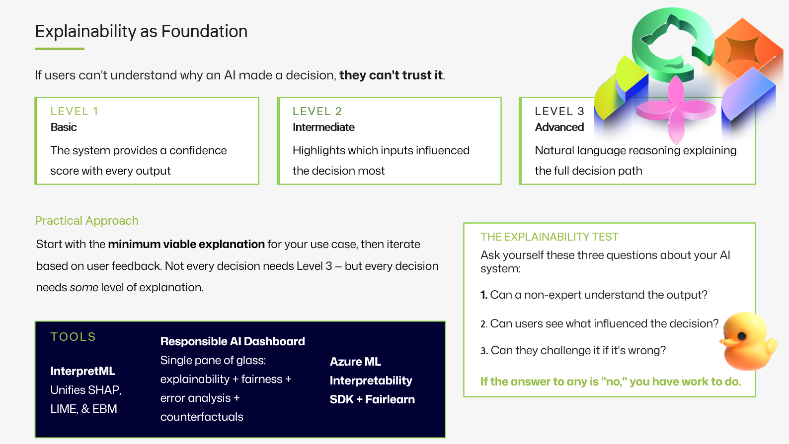
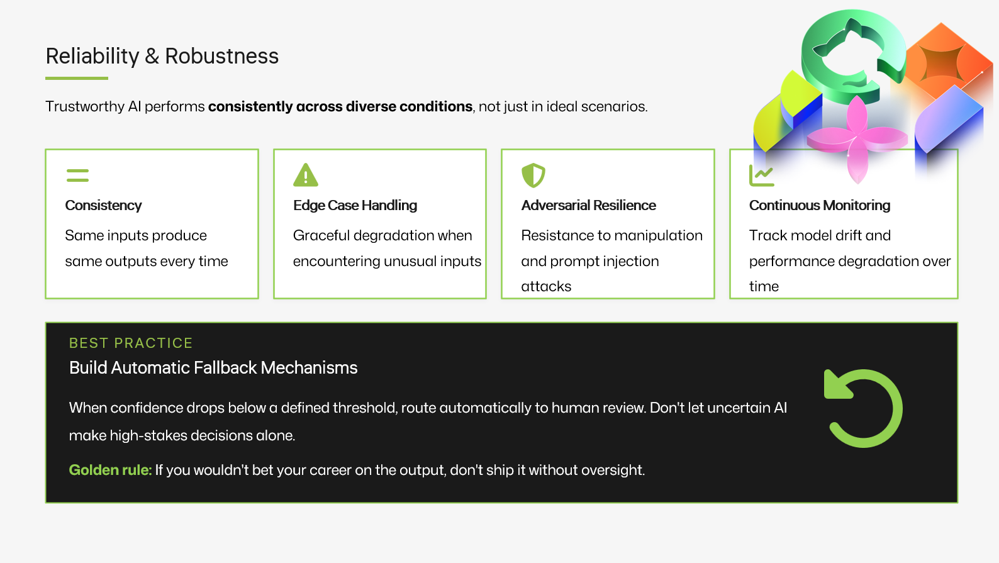
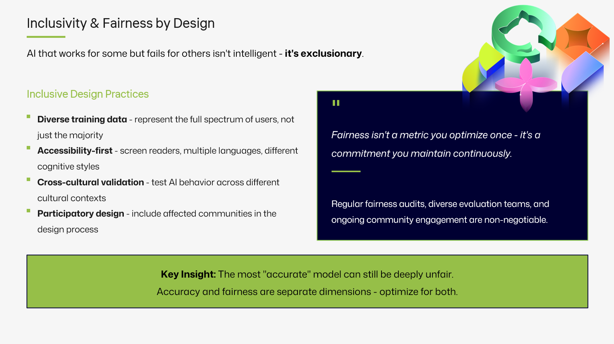
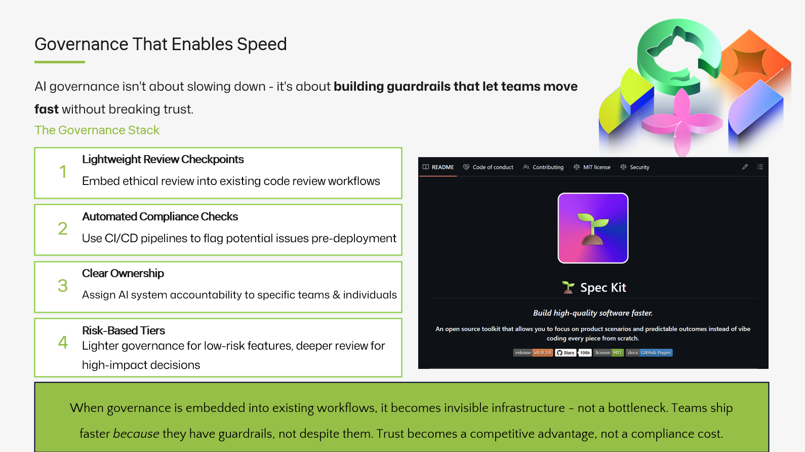
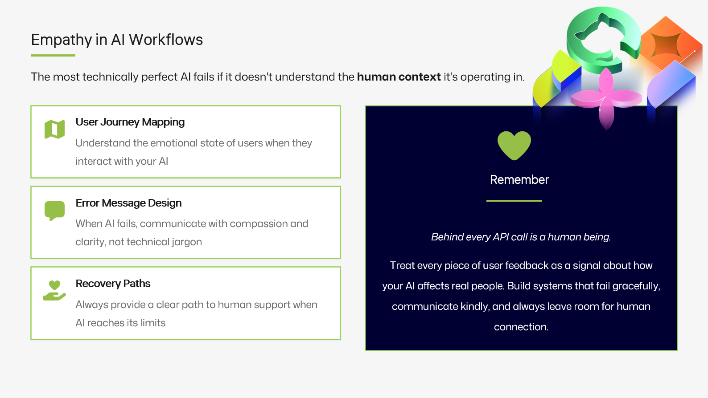
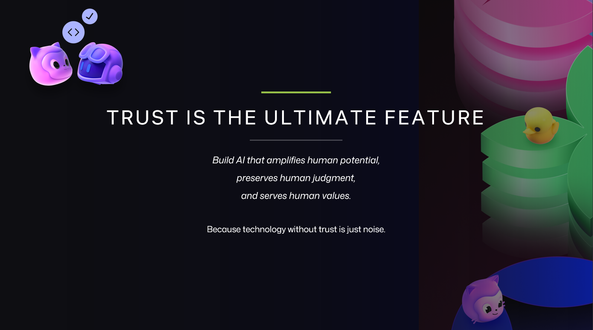

---
hide:
  - navigation
  - toc
---

# Scaling Guacamole

A SlashNew Conf 2026 talk on building, shipping and trusting agentic AI — by <strong>@Codess-Aus</strong>.

[About this talk](chapters/00-welcome.md){ .sn-pill }

<a class="sn-card" href="chapters/00-welcome/">
  
  

    
February 16, 2026

    <h3>00 · Welcome to SlashNew</h3>
    
Why we're here, who this talk is for, and the one question we keep coming back to: can we trust the systems we build?

    
Read more →

  

</a>

<a class="sn-card" href="chapters/01-agenda/">
  
  

    
February 16, 2026

    <h3>01 · The Agenda</h3>
    
A roadmap through trust, oversight, governance and the three waves of AI that brought us here.

    
Read more →

  

</a>

<a class="sn-card" href="chapters/02-rulezero/">
  
  

    
February 16, 2026

    <h3>02 · Rule Zero</h3>
    
Before you ship anything else, ship trust. The non-negotiable rule that frames every decision after it.

    
Read more →

  

</a>

<a class="sn-card" href="chapters/03-therightway/">
  
  

    
February 16, 2026

    <h3>03 · The Right Way</h3>
    
Microsoft's Responsible AI Standard, in plain English. What it actually asks of you on a Tuesday.

    
Read more →

  

</a>

<a class="sn-card" href="chapters/04-trust/">
  
  

    
February 16, 2026

    <h3>04 · Earning Trust</h3>
    
Trust isn't a feature you toggle on. It's a UX, a process and a contract — built one decision at a time.

    
Read more →

  

</a>

<a class="sn-card" href="chapters/05-themoment/">
  
  

    
February 16, 2026

    <h3>05 · The Moment</h3>
    
We're inside the inflection. Why "general-purpose reasoning in the IDE" changes the shape of every team.

    
Read more →

  

</a>

<a class="sn-card" href="chapters/06-feature/">
  
  

    
February 16, 2026

    <h3>06 · It's a Feature, Not a Bug</h3>
    
Hallucinations, uncertainty, refusal — they're not always failure modes. Sometimes they're the product working.

    
Read more →

  

</a>

<a class="sn-card" href="chapters/07-hitl/">
  
  

    
February 16, 2026

    <h3>07 · Human in the Loop</h3>
    
HITL done well is empowering, not theatre. A practical pattern catalogue for keeping people in charge.

    
Read more →

  

</a>

<a class="sn-card" href="chapters/08-amplify/">
  
  

    
February 16, 2026

    <h3>08 · Amplify, Don't Replace</h3>
    
The teams winning with Copilot aren't replacing engineers. They're amplifying judgment, taste and craft.

    
Read more →

  

</a>

<a class="sn-card" href="chapters/09-oversight/">
  
  

    
February 16, 2026

    <h3>09 · Meaningful Oversight</h3>
    
Approval buttons aren't oversight. What real, decision-grade human review looks like in an agentic pipeline.

    
Read more →

  

</a>

<a class="sn-card" href="chapters/10-dm/">
  
  

    
February 16, 2026

    <h3>10 · Decision Making with AI</h3>
    
How to use models for decisions that matter — without outsourcing accountability with them.

    
Read more →

  

</a>

<a class="sn-card" href="chapters/11-principles/">
  
  

    
February 16, 2026

    <h3>11 · Principles That Hold</h3>
    
The six Microsoft Responsible AI principles, and how they translate into testable engineering behaviour.

    
Read more →

  

</a>

<a class="sn-card" href="chapters/12-explainability/">
  
  

    
February 16, 2026

    <h3>12 · Explainability</h3>
    
"Because the model said so" is not an answer. Designing systems that can tell you <em>why</em>.

    
Read more →

  

</a>

<a class="sn-card" href="chapters/13-reliability/">
  
  

    
February 16, 2026

    <h3>13 · Reliability & Safety</h3>
    
Evals, red teaming, regression budgets — treating reliability as a first-class engineering metric.

    
Read more →

  

</a>

<a class="sn-card" href="chapters/14-inclusivity/">
  
  

    
February 16, 2026

    <h3>14 · Inclusivity by Design</h3>
    
If it doesn't work for everyone, it doesn't work. Practical inclusivity for agentic products.

    
Read more →

  

</a>

<a class="sn-card" href="chapters/15-realworld/">
  
  

    
February 16, 2026

    <h3>15 · Real-World Stories</h3>
    
Three short case studies — what worked, what broke, and what we learned from shipping agents in production.

    
Read more →

  

</a>

<a class="sn-card" href="chapters/16-3waves/">
  
  

    
February 16, 2026

    <h3>16 · The Three Waves</h3>
    
From autocomplete, to chat, to agents. Where you sit on the wave changes what "good" looks like.

    
Read more →

  

</a>

<a class="sn-card" href="chapters/17-governance/">
  
  

    
February 16, 2026

    <h3>17 · Governance</h3>
    
How to do AI governance without becoming the team everyone routes around. Light-touch, high-trust.

    
Read more →

  

</a>

<a class="sn-card" href="chapters/18-empathy/">
  
  

    
February 16, 2026

    <h3>18 · Leading with Empathy</h3>
    
Your team is anxious about AI. That's data. How leaders turn fear into capability.

    
Read more →

  

</a>

<a class="sn-card" href="chapters/19-actions/">
  
  

    
February 16, 2026

    <h3>19 · Take Action</h3>
    
Five concrete things to do on Monday. No theory. Just the next move.

    
Read more →

  

</a>

<a class="sn-card" href="chapters/20-resources/">
  
  

    
February 16, 2026

    <h3>20 · Resources</h3>
    
Microsoft Learn paths, GitHub docs, books and tools — the curated reading list behind the talk.

    
Read more →

  

</a>

<a class="sn-card" href="chapters/21-trust/">
  
  

    
February 16, 2026

    <h3>21 · Closing — Trust, Again</h3>
    
We end where we started. Trust isn't a slide at the end of the deck. It's the whole product.

    
Read more →

  

</a>

